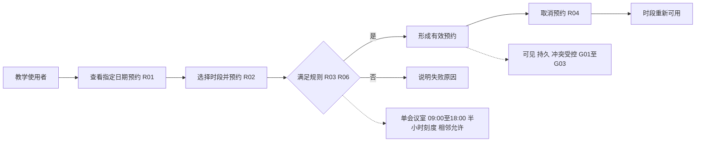
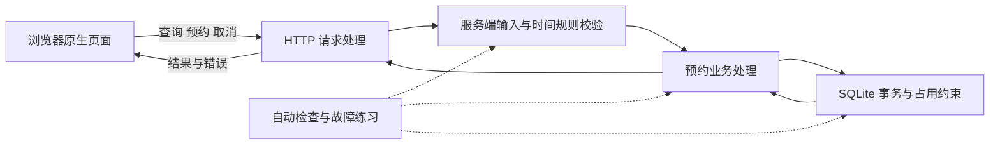
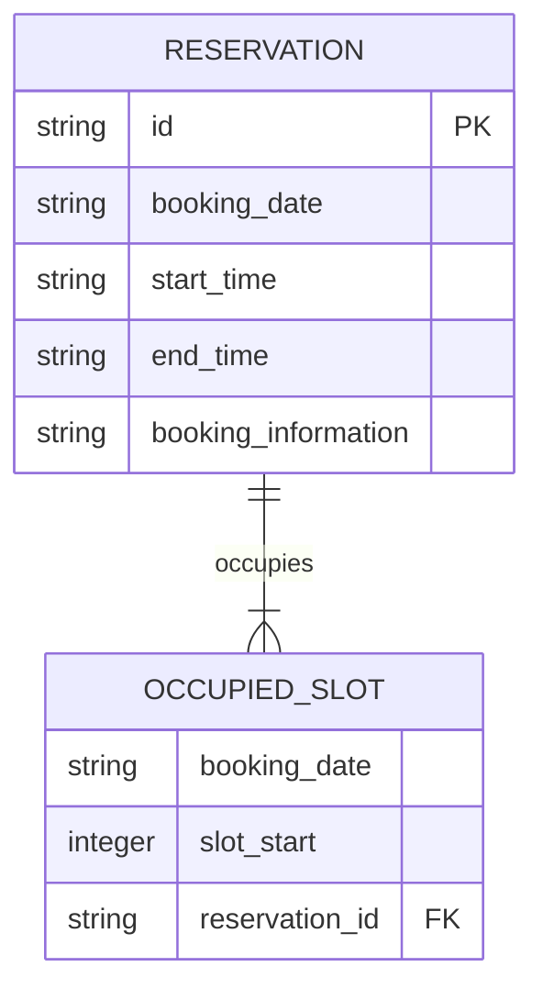
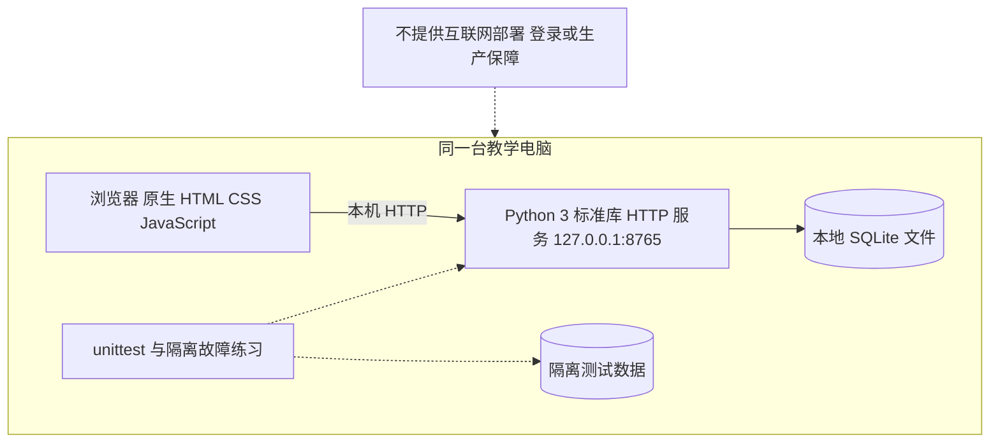

# 会议室预约：4A 架构与关键决策

版本：1.0；对应 CASE-ROOM-01 需求 1.0；日期：2026-10-03。

本文件为虚构教学应用设计。4A 暂按 BA 业务、AA 应用、DA 数据、TA 技术四类解释；真实项目沿用客户或部门定义。四个 Mermaid 代码块即为可编辑图源；标识是逻辑职责，未声称与代码函数一一同名。

离线查看四张独立矢量图：[BA](../architecture-views/ba.svg)、[AA](../architecture-views/aa.svg)、[DA](../architecture-views/da.svg)、[TA](../architecture-views/ta.svg)。图与本文对应同一教学版本；修改架构时一并更新。

## BA：业务架构

业务边界是本机练习。没有登录和审批角色；不得把图中的“教学使用者”解读为已经完成用户身份验证。验收责任由人承担。

## AA：应用架构

页面负责采集信息和反馈结果；服务端维护真正的业务规则；存储层负责持久化及并发下的唯一占用。即使页面禁止选择 09:15，服务端仍须拒绝绕过页面直接送来的 09:15。故障练习使用隔离数据，不能破坏日常演示库。

## DA：数据架构

图是逻辑模型：`booking_information` 表示页面要求的虚构预约信息，不限定实际列名。每条预约拥有一个或多个半小时占用格；同一日期和同一开始格只能属于一条有效预约。单会议室省略 room_id；若扩展多会议室，必须重新分析业务、数据唯一键及接口，而非只加页面选项。

与当前代码的对应：逻辑 `RESERVATION` 对应 `bookings`，字段为 `id`（文本标识）、`day`、`start_minute`、`end_minute`、`name`、`purpose`；逻辑 `OCCUPIED_SLOT` 对应 `slots(day,start_minute,booking_id)`，复合主键为 `(day,start_minute)`，外键删除级联释放占用。页面时间字符串经校验后转换为分钟数。创建使用 `BEGIN IMMEDIATE` 事务；占用冲突整笔回滚并反馈 HTTP 409。

创建预约与写入全部占用格必须处于同一事务：全部成功才提交，发生冲突整体回滚。取消预约与释放全部占用格也应原子完成。预约信息从页面经服务端写入本地数据库，查询再回到页面；刷新和服务重启不应清空同一数据文件。取消采用删除的教学语义，不提供审计、合规保留或恢复单条记录能力。

## TA：技术架构

本地启动：`python3 demo/app.py --port 8765`。运行检查：`python3 -m unittest discover -s demo/tests -v`。故障练习：`python3 demo/labs/failure_lab.py`。均在项目根目录执行，具体结果以实际执行记录为准。

## 四个视图的对应关系

| 需求 | BA 业务 | AA 职责 | DA 数据 | TA 依赖 | 验收 |
|---|---|---|---|---|---|
| R01/R02 | 查看与预约 | 页面、请求处理、业务处理 | 预约与占用格 | 浏览器、HTTP、SQLite | A01/A02 |
| R03/R06 | 时段与输入规则 | 服务端校验、业务处理 | 日期与半小时占用格 | 标准库时间处理、数据库约束 | A03/A06 |
| R04/R05 | 取消与持久可见 | 业务处理、事务 | 删除预约/占用格、保存文件 | 同一 SQLite 文件与正常重启 | A04/A05 |
| R07/R08 | 本地边界与唯一预约 | 请求处理、冲突反馈 | 唯一占用与事务回滚 | 本机绑定、并发访问与隔离测试 | A07/A08 |

## 关键决策记录

| 编号 | 决策与理由 | 代价及复议条件 |
|---|---|---|
| ADR-01 | 使用 Python 标准库、SQLite 和原生页面，降低入门环境准备成本 | 不据此推荐生产技术栈；真实部署约束出现时重新评估 |
| ADR-02 | 固定半小时格，借助数据唯一性和事务防止并发重复占用 | 不支持任意分钟；需求变化需要重新评估数据模型 |
| ADR-03 | 服务端重复校验页面已限制的输入 | 多一处实现但保护业务边界；测试应覆盖绕过页面的输入 |
| ADR-04 | 仅监听 127.0.0.1，无登录审批 | 易于本地教学；不能满足跨人共享与权限隔离 |
| ADR-05 | 演练故障与正式演示数据隔离 | 需要两类数据环境；确保失败可重复且可恢复 |

## 变更检查与交付说明

新增审批时，BA 新增申请/审批/驳回规则；AA 新增状态迁移与身份权限职责；DA 新增状态、审批关系及历史需求；TA 需要重新确认身份服务、部署环境和运维责任。这些变化仅在[变更演练](change-example.md)中评估，本期程序未实现。

客户部署只使用[对齐表](../../templates/deployment-alignment.md)确认环境、准入、就绪时间及责任。运行质量使用[DfX 矩阵](../../templates/dfx-matrix.md)规划可检验目标；本地试验结果不得外推成生产性能或可用性承诺。
