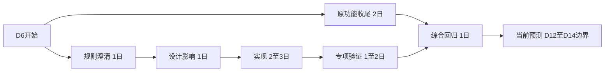

# 已填案例：新增审批怎样影响交付承诺

版本：1.1；日期：2026-10-04。**全文为虚构教学演练，角色、工作量、日期、估算和决策均是假设，不是实际批准或客户工期评估。** D1、D2 等表示项目工作日，不是自然日期。

自学用法：先读第 1—3 节，自己画依赖并计算剩余历时；再看第 4 节比较选项，写一个建议。最后对照参考决策和第 6 节的变体。你的选项可以不同，但假设、权限与计算依据必须清楚。

## 1. 原范围与变更

原教学基线 B0：单会议室、查看、预约、取消、冲突控制与持久化；对应 [R01—R08](requirements.md)。原承诺：D10 完成基线验收后供本地试用。当前演练时点：D6 开始。

CR-001：虚构行政负责人提出“增加主管审批，再给大家用”。业务原因：跨部门申请需要有人确认使用顺序。最初口述尚未形成可开发需求，需明确谁有资格审批、待审批是否占用时段、驳回后怎样通知、取消是否再审批、数据对谁可见。

变更性质：新增范围。原功能未完成的缺陷仍按原基线修复；不能把缺陷都记入本次变更来解释延期。以下用于估算的临时假设是“单级审批、待审批占用、驳回释放、只有授权审批人可操作”；真实实施前必须确认。当前教学代码没有实现这些功能。

## 2. 影响清单

| 方面 | 增量与返工 | 依赖/待确认 |
|---|---|---|
| BA | 新增申请、批准、驳回、撤回规则及异常流程 | 业务负责人确认状态和占用规则 |
| AA | 新增审批接口、状态校验、身份与权限边界，调整页面反馈 | 身份来源与审批人规则 |
| DA | 预约状态、审批关系、历史需求，调整取消/释放语义 | 旧记录默认状态及迁移验证 |
| TA/部署 | 原本地演示边界不足以支持真实多用户审批 | 客户环境、账号与准入就绪 |
| 验证 | 状态迁移、越权、重复审批、并发、旧功能回归 | 测试账号与验收人时间 |
| 交付 | 需求、架构、操作说明、操作示例和学习材料更新 | 周边同步与新验收条件确认 |

## 3. 用依赖关系计算日期，而不是把人日当作延期

为单独练习排程，以下**假设身份能力和环境已就绪**；若不成立，新增外部等待必须另排，本区间失效。开发甲负责原功能收尾，具备相应能力的开发乙承担新增分支；两人已获准投入且工作可并行。估算按工作日计，不含假日、兼职和额外等待。

原剩余计划：原功能收尾 2 日 → 综合回归/验收准备 1 日 → 剩余缓冲 1 日，共 4 日，从 D6 开始到 D10 边界完成。

| 任务 | 前置 | 工期假设 | 实施者假设 |
|---|---|---|---|
| B1 原功能收尾 | 无 | 2 日 | 开发甲 |
| C1 澄清规则 | 授权开展评估 | 1 日 | 业务代表与开发乙 |
| C2 设计/数据影响 | C1 | 1 日 | 开发乙 |
| C3 审批实现及必要材料 | C2 | 2—3 日 | 开发乙 |
| C4 审批专项验证/修复 | C3 | 1—2 日 | 开发乙与评审人 |
| I 综合回归与验收准备 | B1、C4 | 1 日 | 甲乙协同 |

读依赖的顺序：D6 同时开始 B1 与 C1；新增审批分支按 C1 → C2 → C3 → C4 顺序执行；只有 B1 和 C4 都完成，才能开始 I 综合回归。因此最后完成时间由较长分支决定，再加 I，不能把并行分支直接相加。

可编辑图源

新增分支长 5—7 日，比原实现分支的 2 日长 3—5 日。两分支并行后，再做 1 日综合回归，总剩余历时为 6—8 日。原计划含 1 日可用缓冲，因此相对原剩余 4 日，预测延期 **2—4 个工作日**。该方案消耗全部剩余缓冲；残余风险需单列，不能声称仍有相同保障。

这只是给定假设下的区间推演，不是统计置信区间。投入工作量另按每位人员的实际占用汇总；不能把任务工期相加叫作“总人日”，更不能用总人日除以人数确定新日期。资源冲突、返工依赖或身份服务等待出现时，重画网络并更新预测。

## 4. 供授权人选择的方案

| 方案 | 价值与范围 | 时间预测 | 条件/代价 |
|---|---|---|---|
| A 原范围先试用 | D10 交付 B0，审批另列下一阶段 | 原目标暂保持，仍需通过原验收 | 行政接受先按原流程管理；审批未被默认批准 |
| B 一起交付 | 本期包含审批 | 上述假设下 D12—D14 | 需批准范围/资源调整；身份及环境假设须验证 |
| C 分期并设审批试点 | D10 本地基础试用，另选小范围验证审批 | 基础同 A；审批在澄清后承诺 | 两次验收和沟通成本；不能把本地工具开放成生产服务 |
| D 替换低优先级范围 | 删除/延后双方同意的工作以换入审批 | 必须重排，当前无可信日期 | 持久化、冲突正确性等必要验收不作为可牺牲项 |

增加人员只有在任务可切分、人员具备能力、加入成本可接受时才可能缩短历时；本例不能承诺“多一人就恢复 D10”。

## 5. 沟通话术与演练决策

对客户：

> 新增审批可以支持跨部门确认，但会改变状态、权限和验收范围。原基线是查看、预约、取消；它仍可以按原验收推进。若审批本次一起交付，在身份和环境已就绪、人员投入成立的假设下，预测比原计划晚 2—4 个工作日。建议先按 D10 提供原范围试用，审批确认规则后单独约定日期。请有权调整范围与里程碑的负责人选择方案，避免把预测直接当成新承诺。

对上下游：说明需要提供的规则、账号/环境、交接内容、最晚决策时间和等待影响。对研发测试：同步新增验收例子、可改边界及独立回归项。对主管：同一份数据展示价值、工期区间、缓冲变化、资源条件与风险。

**参考决策假设：** 假定具备权限的负责人选择 A；D10 的 B0 范围保持，CR-001 转入下一阶段待规则确认。这是已填教学示例，现实中没有人批准此决定。下一阶段具体日期仍为待定，不得写成“已同意延期”。

真实项目应记录授权人、权限来源、时间、确认载体、所选方案、范围差异和新基线版本。最晚决策时间需依据任务依赖协商；未及时决定不等于默认批准。继续推进不依赖该决定的已授权工作，并报告等待带来的预测变化。

## 6. 自己推演，再核对依据

练习：开发乙只有半天可用，或身份环境需再等 3 日时，能否继续引用“延期 2—4 日”？

答案：不能。原区间的人员和环境前提已经失效。应把可用日历、等待关系和能并行的任务加入计划，再给新预测；等待 3 日也未必逐日相加，因为部分澄清/设计可能仍可先行。向批准人展示变化及备选方案，保留原基线和上一版预测。

使用[变更模板](../../templates/change-control.md)进行第二次练习；使用[周报案例](weekly-report-example.md)检查它是否清楚区分了承诺、预测和待决。
