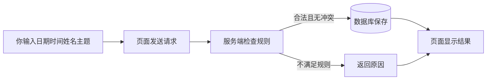

# 新手指南：从一句想法走到可以验收的小功能

版本：1.0；日期：2026-10-03。适用：没有编码经验、希望参与需求与软件改进的同事。目标：看懂软件最基本的组成，描述一个小任务，亲手验证并清楚求助。正式业务交付中的技术把关由具备相应能力的人承担。

先读[共同开篇](../../training/00-opening.md)中的虚构故事：页面出现了，预约却在刷新后消失。接下来要学会说清“输入是什么、遵守什么规则、数据存在哪里、怎样看到结果”。不要求先学完整门编程语言。

## 1. 六个概念，贯穿一个动作

| 概念 | 白话解释 | 预约例子 |
|---|---|---|
| 需求 | 使用者在什么情况下需要什么结果 | 明天找一段空闲时间开会 |
| 页面/前端 | 浏览器里看到与操作的部分 | 日期框、时间框、预约按钮和列表 |
| 服务端/后端 | 收到操作后执行规则的程序 | 检查时间是否合法、是否冲突 |
| 数据库 | 保存并组织记录的地方 | 预约与占用时段，刷新后仍可查 |
| 接口 | 页面与服务端约定的传递方式 | 页面发起预约请求，服务端返回成功或失败 |
| 测试/验收 | 用具体例子比较预期和实际 | 已有10—11，再约10:30—11:30必须失败 |



刷新会重新加载页面。若数据只留在页面内存，刷新后可能消失；本例把数据保存在数据库。现实中同样现象也可能是日期选错、请求失败或使用了另一个数据库，不能仅凭现象确定原因。

“代码”是程序指令；“终端”是输入运行命令的窗口；“进程”是正在运行的程序；“端口 8765”帮助浏览器找到本机服务；“日志”记录发生了什么。复制命令前先知道它用于启动、检查还是修改数据，不能把所有提示都当作错误。

## 2. 把模糊想法改写成任务

模糊说法：“做个好用的预约系统。”可执行说法：“在选定日期输入虚构姓名、主题和10:00—11:00，提交后列表能看到预约；刷新后仍存在；与已有10:00—11:00重叠的10:30—11:30必须被拒绝。”

使用[场景模板](../../templates/scenario-baseline.md)写出使用者、目的、输入、规则、结果和验收人。先提出三个问题：谁使用？什么算冲突？数据需要保留多久/怎样保存？不确定内容写待确认；不要自动把登录、审批、通知都加入本期。

软件设计先决定各部分的责任。例如页面负责显示，服务端负责规则，数据库负责保存。可以请 AI 先画这个关系、说明需要哪些步骤，再逐步实现。当前案例的[4A 视图](../case/architecture.md)从业务、应用、数据、技术四个角度描述同一个工具；初学先看 BA 和 AA。

## 3. 运行本地案例

准备：取得完整项目文件，按[运行说明](../../demo/README.md)确认 Python 3 可用。用编辑器打开项目文件夹，在该文件夹的终端执行：

```bash
python3 demo/app.py --port 8765
```

终端保持运行是正常现象。浏览器打开 `http://127.0.0.1:8765`。只使用虚构姓名和主题；该服务仅本机教学，没有账号和审批。

若提示找不到文件，先检查终端是否位于包含 `demo` 文件夹的项目根目录；若找不到 `python3`，请导师协助检查运行环境；若端口被占用，先确认是不是已有同一教学服务运行，不要随意结束未知进程。把完整错误文本提供给导师。

停止服务时在对应终端按 `Ctrl+C`；不要把关闭浏览器理解为停止服务。重新启动后应使用同一数据库才能继续看到原记录，具体位置以运行说明为准。

## 4. 第一次亲手验收

选择没有已有预约的教学日期，填写虚构姓名“学员甲”和主题“演练”。每做一步立刻记结果；看到失败时记录失败，不把预期抄成实测。

| 步骤 | 预期 | 实际结果（自己填写） |
|---|---|---|
| 预约10:00—11:00 | 列表出现相同日期和时间 | 待操作 |
| 刷新页面并查看同一日期 | 记录仍在 | 待操作 |
| 预约11:00—12:00 | 相邻可成功 | 待操作 |
| 预约10:30—11:30 | 重叠被拒绝，原记录不变 | 待操作 |
| 取消第一条，再订10:00—11:00 | 可以重新预约 | 待操作 |
| 尝试结束早于开始 | 被拒绝且没有新记录 | 待操作 |

时间用 `[开始,结束)` 理解：前一个预约到11:00结束，后一个可以11:00开始。当前范围是09:00—18:00、半小时刻度、同一所选日期内；没有午休限制，午休是后续练习中的新增需求。

完成这些操作不代表已经验证同时预约、生产安全或所有异常。请在提交中写出至少一项未检查范围，体现你知道证据的边界。

## 5. 一个新任务怎样与 AI 协作

新手独立练习可以从提示文案开始：把“预约失败”改成能帮助用户采取下一步的说明。先列出输入非法、时间冲突、服务不可用三个不同情境，再向导师确认实际代码支持的区分方式。不要要求所有失败都显示“请换时间”，因为服务不可用并非时间冲突。

在独立练习副本中给 AI 任务：阅读需求与现有实现，说明需要改哪里；只调整当前错误反馈，不改变预约规则；提出正常和失败例子；实际运行适用检查并说明未验证项。你负责确认页面是否清楚、按例子验收；导师负责代码与服务端行为检查。协助程度如实登记。

进阶时参与[午休变更 L4](../../training/exercises.md)，负责边界例子与已有预约处理问题，由工程师承担实现与技术审查。这样你能参与完整交付，又知道哪些判断需要专业帮助。

## 6. 遇到问题，怎样求助更有效

可直接使用：

```text
我想完成：刷新后仍看到预约（A05）。
环境：本机教学，浏览器与服务正在运行；代码版本填写实际值。
操作：选择某日期，预约10:00—11:00，看到成功，然后刷新。
预期：列表仍有记录。
实际：列表为空（这是填写示例，按你的真实观察修改）。
我检查过：刷新后选择的日期相同；附终端错误或请求结果。
需要帮助：请协助复现，判断是查询、保存还是环境问题。
```

不要贴入真实客户数据或账号秘密。导师会先帮助你缩小问题，再决定由谁处理。可从[FAQ](../../faq/README.md)找到常见路径。

## 7. 完成标准

完成 L1、L2，并交一项新的小任务记录。你应能解释页面、服务端和数据库的关系，写出正常与异常例子，区分预期和实际，清楚说明尚未验证的内容，并带着复现步骤求助。一次练习完成不等于已经能独立负责生产系统，后续按[能力考核](../../templates/capability-pilot.md)逐步扩大任务范围。
